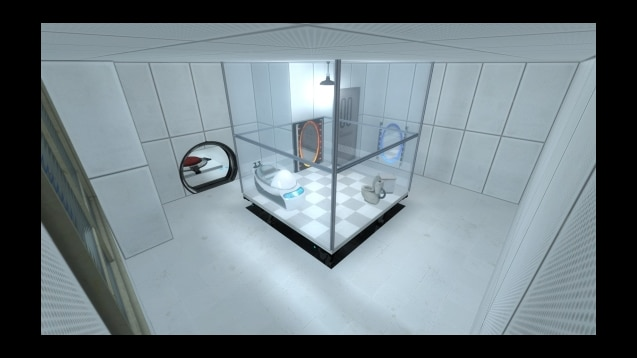

# **[Working Title Placeholder] – Game Design Document**

---

## **Executive Summary**

### **Concept Statement**

[Game name] puts you in place of the office's newest (and only competent) technician. Unfortunately the previous techie left everything in a state of absolute chaos: the printer only works while the kettle is brewing, light switches controlling the microwave and security systems only working on a tuesday! Your job? Move about the office, find these ridiculous issues and patch it all back together using whatever the old techie left behind.
The game combines first-person exploration with top-down, grid-based logic puzzles grounded in real computer science concepts. Each issue is solved through using logic gate components -- AND, OR, XNOR and more -- to produce correct outputs and restoring the broken systems. Through trial and error, visual feedback and escalating complexity, players will develop a thorough understanding of Boolean logic, signal flow and problem solving while gradually bringing the most dysfunctional office back to life.

---

## **Game Overview and Concept**

Click to expand

### **Working Title**

### **Genre**

* Puzzle
* Educational
* Top-down 3D
* Absurd comedy

### **Target Audience**

#### Who will play
  * Computing students
  * People who enjoy puzzle games
  * People who enjoy tech humour
#### Why they play
  * challenge themselves with tech puzzles
  * fix the office
#### Age range
  * 8+
#### Accessibility
  * Tutorial system
  * Toggle between words/symbols
  * Actions have audio feedback
  * Control remapping (stretch)
  * UI readability
#### Intended play session duration
  * 10-20 minutes minimum
#### Target age rating
  * PEGI 7

### **USP**

* Interactive implementation of AND/NOT/XOR logic gates
* Puzzles mirroring computing logic
* Grid based puzzle layout
* Constant and immediate feedback on puzzle solutions
* Light physics involved for more *active* environment
* Humourous/absurd setting making logic concepts more digestible
* Hybrid presentation (first person + top down) adds visual variety
* Scalable by adding extra office environments

### **Player experience**

Describe intended experience from playing the game

#### Who is the player:   
 Office tech left to inherit old system
#### Player fantasy:      
 Feeling like the only person with any sense
#### How its presented:
  * (Hub): First-person 3D
  * (Puzzles): Top-down 3D
#### What emotions do i want
  * Satisfaction
  * Curiosity
  * Revelations (figuring out difficult puzzles)
#### Why does the player return
  * Progress puzzles
  * Fix office chaos
  * Learn new concepts
  * Player interest
    * Growing absurdity
    * Sense of achievement
    * Variety of puzzles
    * Combination of puzzle types

#### Intended learning outcomes
Players engaging in the puzzles should develop:
- Good understanding of boolean values
- Recognition of common logic gates
- Ability to use gates in expressions
- Visual reasoning about signal flows
- Intuition of circuit building and computer science thinking
Supporting material will be available in game to provide more details about components of the game

---

## **Gameplay Mechanics**

Click to expand

### **Core Loop**

Primary loop:

* Hub -> Puzzle -> Hub

Puzzle loop:

* Assess problem
* Place/move logic component blocks
* Test solution
* Adjust and repeat until solved
* Hints/resetting available

Why is the loop engaging?

* Absurd humour
* Engaging puzzles
* Completing/fixing the office environments

How it helps learning

* Teaches core computing concepts in a fun and digestible way that encourages the players to learn through experimentation, and positively reinforced upon correct solutions though direct positive feedback and long term *fixing* of the office environment being satisfying for the players

### **Objectives and progression**

Players short term goals
Players long term goals

Level flow

* Tutorial -> Single output challenges -> Multi-layered challenge -> truth table challenges

Every few stages can introduce a new concept/gate

* first few puzzles use AND gates only
* next few add in OR gates
* next few add in NOT gates
  Logic builds slowly across multiple puzzles to not overwhelm players with too many new concepts at once

End goal: fix the office systems

Players are able to pick their puzzles from a few available.

* several available puzzles at each stage
* complete 75% to unlock new mechanic/variation
* new puzzles unlocked with a popup/notification upon returning to hub
  * New floating warning signs above newly broken objects
* After enough completed puzzles (75% of total in room) you get a notification from your manager thanking you and telling you about new room with new issues

### **Game systems**

List all systems for the game - explain each

1. Logic gate system
2. Connector system
3. Puzzle manager
4. Player hub interaction
5. Level manager

### **Puzzle System Design**

#### Overview
The puzzle is designed to introduce and teach foundational computer science logic conpects like **AND, OR, NOT, XOR** and truth-tables.  
Players will solve logic puzzles by placing and rearranging logic blocks on a grid-based board (circuit board?), and utilise input signals to produce a desired end result.  
The system will be designed in a way to be scalable, from simple tutorial sections with basic logic to more complex logic chains.

#### Puzzle environment
Each puzzle will be within its own puzzle scene, contextually placed within the main "office" hub.  
The puzzle scene placed before the player will contain:
 - A grid board with tiles avilable for snapping objects to
 - Logic pieces (AND, NOT, XOR etc)
 - Input pieces with fixed binary signal values
 - An output monitor displaying the final result
 - Puzzle specific objects

The grid will be viewable from a static top-down camera, with tiles highlighting when an object is hovering above them to provide tactile feedback for the player as they move the pices around the board.

#### Grid-snap
The visible grid will be made up of multiple slot nodes arranged in rows and columns.  
Each slot will be a snap point that a logic piece can be placed into.  
Functionality:
 - Detects wether a piece is placed inside it
 - Detects pieces in adjacent slots
 - Detects pieces held by the player above the slot
 - Passes boolean signals through the grid
 - Visuals highlight free/occupied/blocked states
 - Slots can be enabled/disabled depending on specific puzzles

#### Inputs/Outputs
Input pieces:
 - Represented with boolean values
 - Placed on leftmost column
 - (Puzzle specific) Pre-placed or freely movable within first row
 - Serves as the starting point for the puzzle

Output:
 - Displays final boolean value
 - Determines puzzle goals (unlocking a door, powering the computer)
 - Visual feedback throughout puzzle interaction

#### Logic pieces
These serve as the primary interaction for the player representing boolean logic
 - Types: AND, OR, NOT, NAND, NOR, XOR, XNOR
 - Number of input ports up to 2
 - One output port
 - Can use visual graphic representation or words (toggleable)
 - When placed, connects to adjacent slots
 - Inputs are read from the leftmost slots
 - Ouput is sent to rightmost slots

#### Goals
Each puzzle will have its own context specific goals such as:
 - Produce an output of 1
 - Create a specific truth table configuration
 - Block a signal
 - Convert multiple inpts for a specific output
 - combine gates for a multi-step output

Outputs will be displayed visually throughout the puzzle, success will *solve* the issue (unlock a door, power a computer etc)

#### Example
Level: "Unlock desk drawer"  
Inputs:
 - A = 1
 - B = 0

Goal: Output must equal 1 to unlock the cabinet and at least 1 block must be used  

Pieces available:
 - AND
 - OR
 - NOT

Correct solution:
Place the OR gate between inputs and outputs
A (1) → [ OR ] → Output (1)
B (0)

Output light turns green, and unlocks the drawer.

#### Progression + difficulty
Puzzle difficulty increases gradually  
Level 1 -- Tutorial
 - Single gate soltion
 - One or two inputs
 - Single output value
Level 2 -- Beginner
 - Multi gate solutions
 - Changing outputs
 - Introduction of more gate types
Level 3 -- Intermediate
 - Three or more gate solutiions
 - Disabled grid slots
 - Multiple possible solutions
 - Multiple outputs
Level 4 -- Advanced
 - Complex gate solutions
 - Complex routing
 - Limited block amounts allowed
 - And further challenges

### **Interactivity**

How the player moves in the hub

* Player moves freely in the office space, can walk between desks/obstacles
* Player can pick up some physics enabled 3d objects (coffee mug, stack of paper, bucket)

How the player moves in the levels

* Top down so player can use mouse to select and pick up logic components

Feedback system

* In hub:

  * Puzzle objects highlighted/glowing - possible just for floating/spinning warning symbol above to show interactivity

* In puzzles:

  * Moveable objects: lighter colour scheme
  * Inactive objects: darker colour scheme
  * slots for puzzle objects have inner lit red lights?
  * Once objects in slots the corners turn blue/green to show connection
  * Red warning lights in screen corner to show problem zone
  * Warning lights turn green/yellow upon successful completion

* use UI sketches?

---

## **Story and Narrative Elements**

Click to expand

### **Game world lore**

* why does the world exist - Office tech staff - Future could have different environments (other offices? different types of locations)
* Basic framing

  * office tech
  * hired after last tech abruptly left for incompetence
  * left with responsibility to make the office function
  * office set up so badly weird problems exist
    Puzzles exist as the inner tech world behind the scenes of the absurd issues
    Progress through different rooms/different office locations

---

## **Art Style and Visual Direction**

Click to expand

### **Visual/audio style**

`For now: describe vibes`
`When ready: concept/actual art`

# Vibes

* Minimalist environment, cluttered design
* Simple textures
* Lights to show puzzles progress (red warning light = incomplete, green light = success)
* Distinct differences in office hub style vs puzzle style

  * Warm colour scheme for office environment (chill+absurd vibes)
  * Cold/ darker colour scheme for puzzle screen (to show in the flow tech vibes)
  * Office audio - (soft background)printer beeps, coffee pot brewing, keyboard typing
  * Puzzle audio - harsher beeps for incorrect, light trills for successes

# Assets needed
| **Urgent (Core Gameplay)** | Done | **Essential (Readability / Flow)** | Done | **Nice to Haves (Polish)** | Done | **UI / Usability** | Done |
|----------------------------|------|------------------------------------|------|---------------------------|------|--------------------|------|
| Logic block – AND          | [ ]  | Logic block – OR                   | [ ]  | Logic block – XOR         | [ ]  | Interact prompt    | [ ]  |
| Logic block – NOT          | [ ]  | Input block (0 / 1)                | [ ]  | NAND / NOR blocks         | [ ]  | Hover highlight    | [ ]  |
| Puzzle grid / board        | [ ]  | Output indicator (light/screen)    | [ ]  | Cable / wire visuals      | [ ]  | Success indicator | [ ]  |
| Puzzle desk base           | [ ]  | Desk interaction hotspot           | [ ]  | Animated door (later)     | [ ]  | Failure indicator | [ ]  |
| Block snap points          | [ ]  | Door placeholder (open/closed)     | [ ]  | Powered doors             | [ ]  | Tutorial arrows   | [ ]  |
| Puzzle completion trigger | [ ]  | Level unlock logic                 | [ ]  | Ambient props (plants)    | [ ]  | Tutorial signage  | [ ]  |

| **Clutter / Environment (Usability Dressing)** | Done | **Structural / World Assets** | Done | **Lighting / Mood** | Done | **Audio (Placeholder)** | Done |
|-----------------------------------------------|------|-------------------------------|------|---------------------|------|-------------------------|------|
| Office chair                                  | [ ]  | Walls material                | [ ]  | Ceiling light prefab| [ ]  | Button click sound      | [ ]  |
| Filing cabinet                               | [ ]  | Carpet material               | [ ]  | Desk lamp           | [ ]  | Puzzle success sound    | [ ]  |
| Photo frames                                 | [ ]  | Ceiling tile material         | [ ]  | Emergency light     | [ ]  | Puzzle fail sound       | [ ]  |
| Side desks                                   | [ ]  | Door material                 | [ ]  | Indicator glow      | [ ]  | Door open/close sound   | [ ]  |
| Shelving units                               | [ ]  | Window glass material         | [ ]  | Highlight light     | [ ]  | Ambient office hum      | [ ]  |
| Whiteboards / notice boards                  | [ ]  | Skirting / trim               | [ ]  | Room fill light     | [ ]  | UI confirm sound        | [ ]  |

### **References**

---

## **Sound Design and Music**

Click to expand

*(Already included in your “Visual/audio style” section – preserved exactly as-is)*

* Office audio - (soft background)printer beeps, coffee pot brewing, keyboard typing
* Puzzle audio - harsher beeps for incorrect, light trills for successes

---

## **Technical Specifications**

Click to expand

### **Tech scope**

* Platform: PC
* Engine:   Godot
* Style:    3D top-down
* Scope:

  * Solo developer
  * 10-20 Levels

    * first person physics enabled hub
    * top down grid system puzzles
  * Custom assets

    * Low polygon assets
    * Simple textures
  * Mouse and keyboard interactivity
* Expected MVP date: Christmas

### **Risks**
Risk assessment carried out using a risk score matrix as provided here:
| Likelihood ↓ / Severity → | Insignificant (1) | Minor (2) | Moderate (3) | Major (4) | Fatal (5) |
| ------------------------- | ----------------- | --------- | ------------ | --------- | --------- |
| **Very Unlikely (1)**     | 1                 | 2         | 3            | 4         | 5         |
| **Unlikely (2)**          | 2                 | 4         | 6            | 8         | 10        |
| **Possible (3)**          | 3                 | 6         | 9            | 12        | 15        |
| **Likely (4)**            | 4                 | 8         | 12           | 16        | 20        |
| **Almost Certain (5)**    | 5                 | 10        | 15           | 20        | 25        |

| Score     | Level     | Category     | Action Required           |
| --------- | --------- | ------------ | ------------------------- |
| **1–4**   | Low       | Acceptable   | No further action needed  |
| **5–9**   | Medium    | Adequate     | Review and monitor        |
| **10–15** | High      | Undesirable  | Address and mitigate      |
| **16–25** | Very High | Unacceptable | Immediate action required |

| Category           | Description | Likelihood (1–5) | Severity (1–5) | Risk Score | Level | Mitigation |
| ------------------ | ----------- | ---------------- | -------------- | ---------- | ----- | ---------- |
| Design             |  Player misunderstanding mechanics  | 3 | 3 | 9 | Medium |  Include a thorough tuturial system and Guide players may refer to at any time  |
| Design             |  Overly-complex puzzles  | 3 | 3 | 9 | Medium |  Start with single-gate puzzles, apply complexity one block at a time, give several levels with new blocks to ensure understanding  |
| Design             |  Learning curve inappropriately steep  | 3 | 2 | 6 | Medium |  Lock advanced mechanics behind earlier puzzle completion, dont require 100% level completiong to move on if too easy  |
| Design             |  Tutorial not clear  | 2 | 3 | 6 | Medium |  Use focussed instructions explaining mechanics one at a time, include visual cues, and guided optional initial interactions  |
| Design             |  Readability issues | 2 | 2 | 4 | Low |  Use contrasting colours, colour-blind safe pallete, descriptions on hover  |
| Technical          |  Grid-snapping complexity  | 3 | 3 | 9 | Medium |  Snapping tolerance zones, clear visual indication on valid slots  |
| Technical          |  Logic gate evaluation logic  | 3 | 4 | 12 | High |  Frequent unit testing on indivisual blocks  |
| Technical          |  Scene switching issues  | 2 | 4 | 8 | Medium |  Preload scenes, ensure clear player state updating on scene change  |
| Technical          |  Physics unpredictability  | 3 | 1 | 3 | Low |  Limit physics interactions during puzzles, clamp movement  |
| Technical          |  Performance issues  | 2 | 4 | 8 | Medium |  Avoid unnecessary physics, use simple models  |
| Scope / Production |  Too many puzzles planned  | 3 | 2 | 6 | Medium |  Prioritise required puzzles before extras  |
| Scope / Production |  Feature creep  | 4 | 3 | 12 | High |  Define MVP requirements, regularly review progress (sprints/gantt/kanban)  |
| Scope / Production |  Custom assets take longer than expected  | 3 | 4 | 12 | High |  Create reusable core assets, plan asset requirements before needed  |
| Scope / Production |  Hub design taking away from puzzles  | 2 | 3 | 6 | Medium |  Implement minimum functionall fidelity, only add details once core gameplay loop is stable  |
| User Experience    |  Unintuitive controls  | 2 | 2 | 4 | Low |  Provide instructions regardless of personal understanding, add on-screen guidance  |
| User Experience    |  Camera switching issues  | 2 | 3 | 6 | Medium |  Frequent testing with users to ensure switching feels suitable  |
| User Experience    |  Accessibility issues  | 2 | 3 | 6 | Medium |  Use readable fonts, make UI scalable, colour-blind suitable palettes, clear sound cues  |
| User Experience    |  UI not clear  | 3 | 2 | 6 | Medium |  Use consistent layout, highlight interactable objects, use tooltips to assist players  |
| Content            |  Insufficient variety  | 3 | 2 | 6 | Medium |  Introduce multiple gate types, add constraints (disabled tiles, limited uses of blocks), environmental variations  |
| Content            |  Concepts not taught properly  | 2 | 4 | 8 | Medium |  Use structured progression, provide accessible guide explaining concepts and usage, research learning pedagogy  |
| Content            |  Humour innapropriate  | 1 | 2 | 2 | Low |  Keep humour light-hearted, avoid sensitive topics, focus humour on office environment, not on people  |

---

## **Project Scope and Timeline**

Click to expand

### **Monetisation**

Initial:

* No monetisation
* Coursework prototype only

Stretch goals:

* Post coursework submission, I may look into publicly releasing the game through Steam as a low cost early access puzzle game
* Possible monetisation through level packs (new offices)

